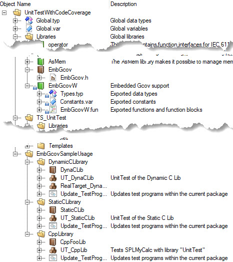
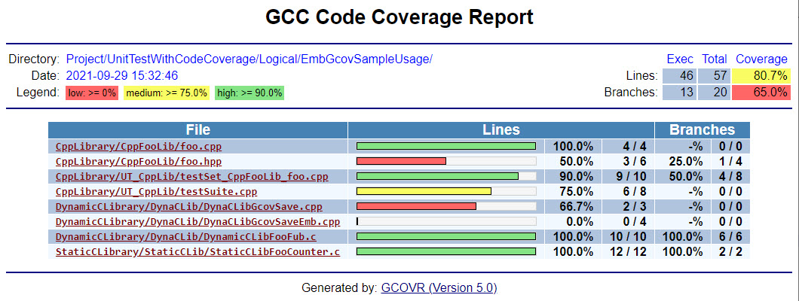
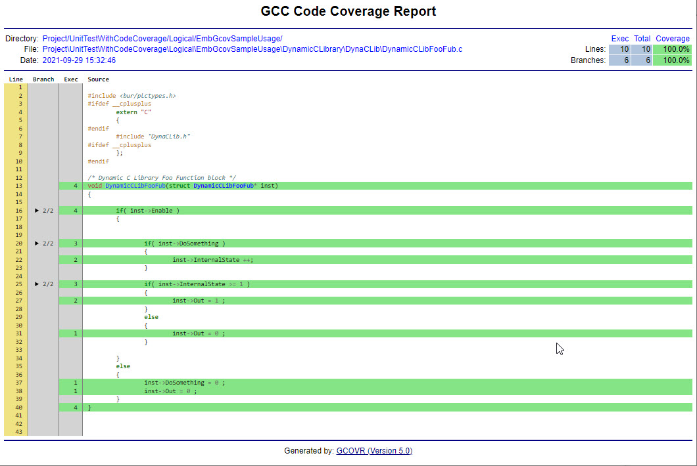
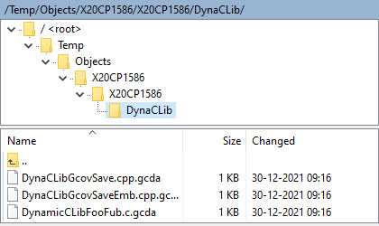
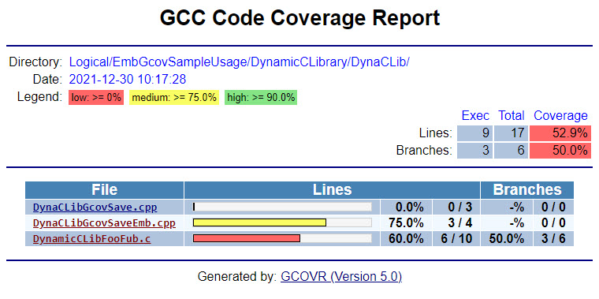
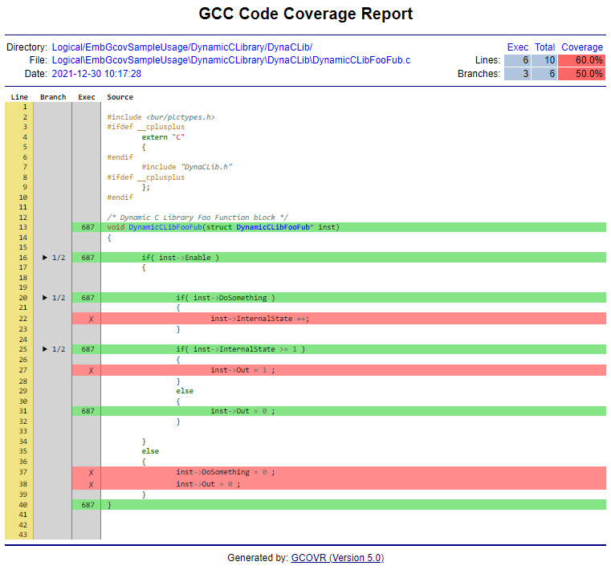
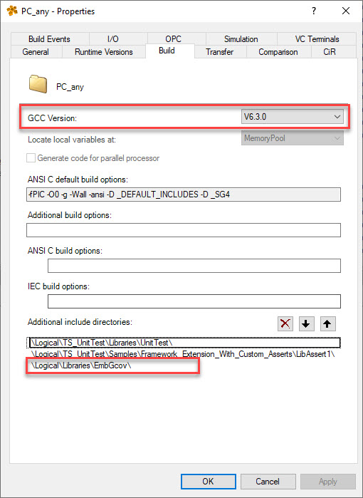
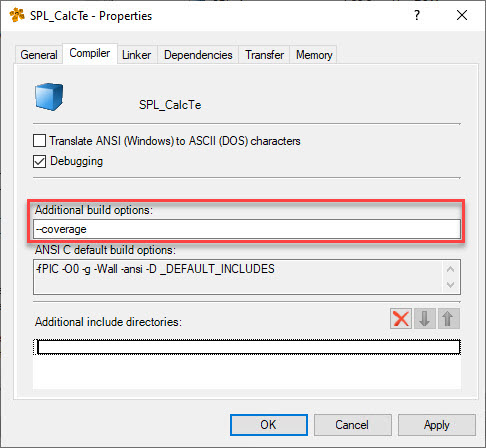
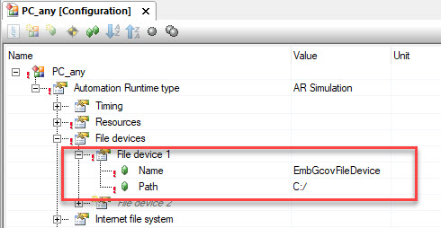

# EmbGcov-Demo
Automation Studio demo project to showcase the Code coverage function of the EmbGcov library.
It contains a small C/C++ tasks and libraries with the help of the UnitTesting package that can be used in Automation Studio.

<!-- TABLE OF CONTENTS -->
## Table of Contents

* [Background](#Background)
* [Getting Started](#getting-started)
* [Usage](#Usage)
* [Usage Demo project](#usage-Demo-project)
* [Usage Demo project on a Real Target](#Usage-Demo-project-on-a-Real-Target)
* [Use libraries in own project](#Use-libraries-in-own-project)
* [Tested](#Tested)

## Background
The GCC compiler supports code coverage with the '--coverage' option in the build option. The problem is that you are missing some implementations from the GCOV part. The functions in 'EmbGcov' library provides the implementation to generate this at an ARSim and in an (real PLC) embedded target. On an embedded target you can run the coverage but keep in mind that the coverage generates some additional cpu load. 

The main part of the EmbGcov is just to generate the *.gcda files. The '-elf-gcov.exe' is used from the GCC compiler to convert the *.gcno and .gcda data in a *.gcov file. The steps to display the coverage result require some 3e party programs but you can generate the coverage html results with other tools.

## Getting Started
The following software parts are required if you want to follow all 'Usage' steps:
- AS4.9.x or higher 
- UnitTest solution installed in AS ( Tested with version 2.0.1.65 this supports the GCC 6.3.0 )
- Python  ( Tested with version 3.9.1 )
- gcovr   ( See https://gcovr.com/en/stable/installation.html for the installation instructions )
- FTP Client ( only required if you want to download the files from an embedded system. )

## Usage Demo project
1. Compile and run the project so that the tests are completed ( Make sure that the all tests are preformed )
	- The data should now be created.

2. Run the 'CreateReport.py' from the script directory. This will search for the .gcda files and creates a coverage report. 

	
	

## Usage Demo project on a Real Target
1. Alter the path in the function 'DynamicCLibGcovSaveEmb'. This should be changed to your project directory. 
2. Change or add an additional user in the FTP Server so you can later download the *.gcda files.
3. Compile and download the project configuration 'X20CP1586' or 'X20CP0484'
4. Open the monitor or watch from the task 'RealTarget_DynaCLib' and set the variable 'saveCoverage' to TRUE. 
	- The data is now saved on the targets USER partition. 
	- ( You could dynamically set the 'EmbGcovFileDevice' to a USB device )
5. Retrieve the data.
	- If your target has a CF or CFAST you could retrieve the data with a USB reader.
	- Or download the files with FTP
	- ( Or remove the USB device if u preformed the optional step )
	
6. Merge the download files with the temp folder of your project.

7. Run the 'CreateReport.py'. This will search for the .gcda files and creates a coverage report. 
	
	
	
##Use libraries in own project
1. Create or use an existing project
2. Add the Unittest solution with version 2.0.1.65 
3. Add the EmbGcov and EmbGcovW library ( Make sure to deploy both libraries in the PLC )
4. Change the GCC version to '6.3.0' and add the '\Logical\Libraries\EmbGcov\' to the additional include directories
	
5. Add the '--codecoverage' to the Additional build options in the task and or library
	
6. Add a filedevice with the name 'EmbGcovFileDevice' with the path the main drive letter the project is compiled from. So in most cases 'C:/'

	
7. Extend the TEARDOWN_SET 
	- Include the EmbGcov.h 
	- Add the function 'EmbGcovExit();' so that after the test is complete the data is saved to the harddrive. 
	- In case of a pure C task add a dummy C++ file with the bur_heap_size declaration. This will add some implementations we need. 
	- In case you want to coverage a library add a dummy function with the 'EmbGcovExit();' aswell. ( If it's a dynamic library please add the function in a CPP file ) 
	
	For more details check the demo project which contains different ideas to create this. 
	
8. Now compile and run the project so that the tests are completed
	- The data is now created. 
9. Copy the 'CreateReport.py' to your project location and make some changes that it can find the project. This will search for the .gcda files and creates a coverage report. 

## Tested
Used the following configuration and hardware to test the library function.

- Automation Studio 4.9.2.46 
	- ARSim 		AR C4.90 
	- X20CPx58x		AR C4.90
	- X20CP048x		AR C4.90
